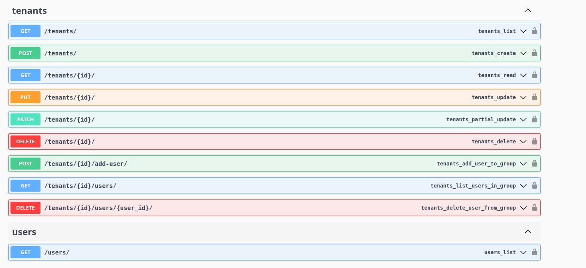
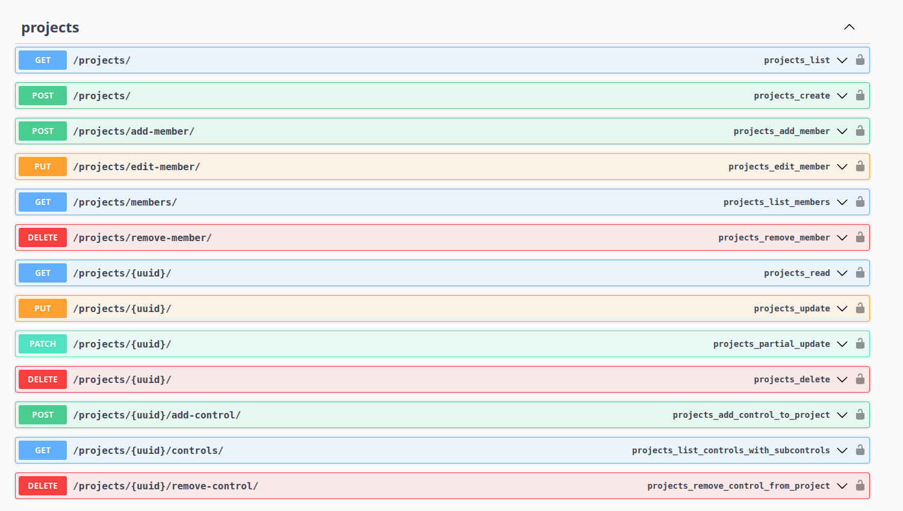

## 🛠️ Backend API 

O backend da aplicação EasyReg foi desenvolvido em Django com o uso de Django REST Framework (DRF), fornecendo uma API RESTful robusta e segura. A documentação da API foi gerada com drf-yasg (Swagger/OpenAPI), permitindo a visualização e teste interativo dos endpoints.

A autenticação de todos os endpoints protegidos é feita via JWT Tokens emitidos pelo Keycloak, garantindo segurança e controlo de acesso baseado em roles.

## 🔐 Gestão de Tenants

O módulo tenants gere as entidades organizacionais (tenants), correspondentes a grupos no Keycloak. A API permite:

    - Listar e criar tenants (GET /tenants/, POST /tenants/);

    - Visualizar, atualizar e eliminar tenants (GET, PUT, PATCH, DELETE por ID);

    - Gerir utilizadores no grupo: adicionar, listar ou remover membros;

    - Todos os endpoints exigem autenticação com permissões apropriadas.

> 📷 Imagem 10 – Endpoints de gestão de tenants com operações completas de CRUD e associação de utilizadores.

## 📁 Gestão de Projetos

O módulo projects permite gerir os projetos associados a um tenant (subgrupos do Keycloak). Inclui:

    - Criação e listagem de projetos (POST /projects/, GET /projects/);

    - Gestão de membros do projeto (adicionar, editar, listar, remover);

    - Associação de frameworks e controls aos projetos;

    - Atualizações parciais ou completas e eliminação de projetos;

    - A autenticação e autorização são aplicadas a todos os endpoints.

> 📷 Imagem 11 – Endpoints para gerir projetos, membros e associação de controlos.
