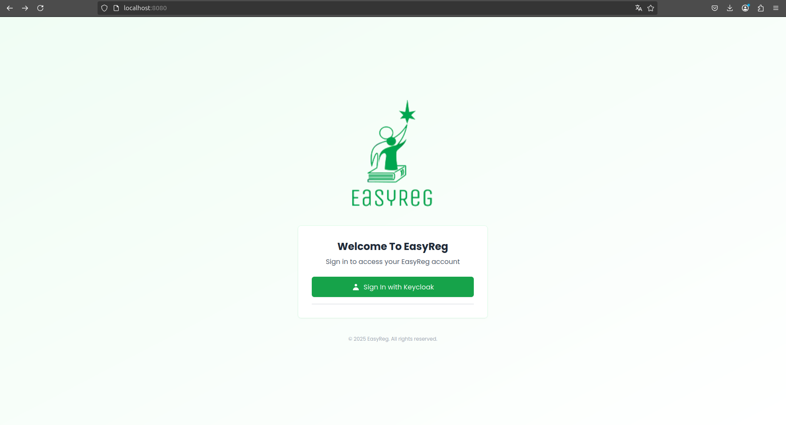
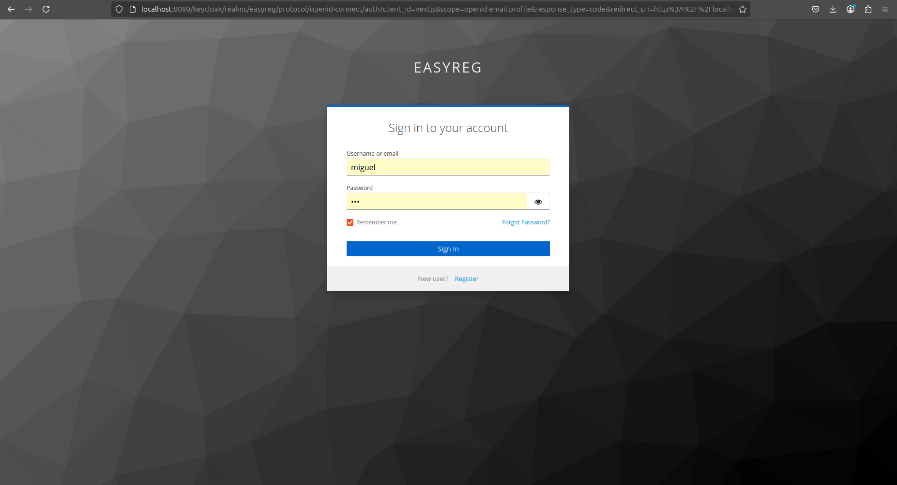
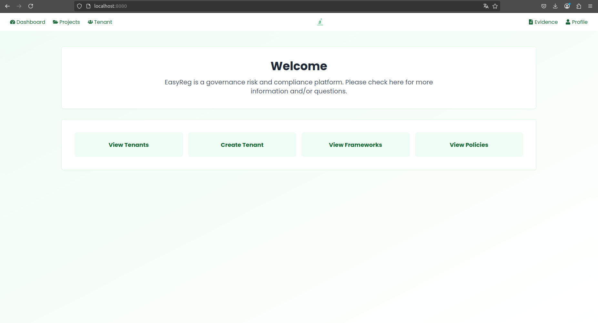
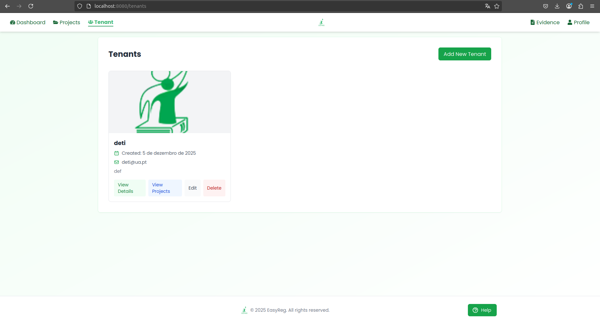
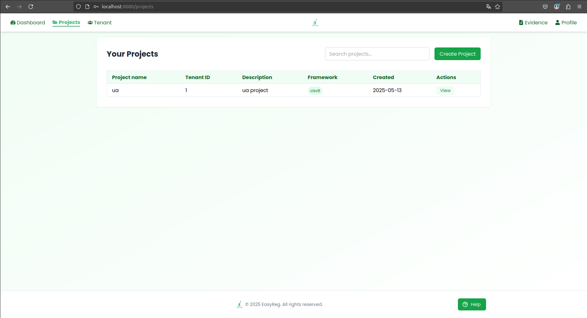
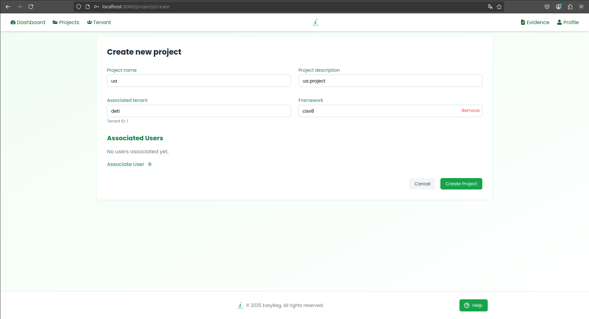
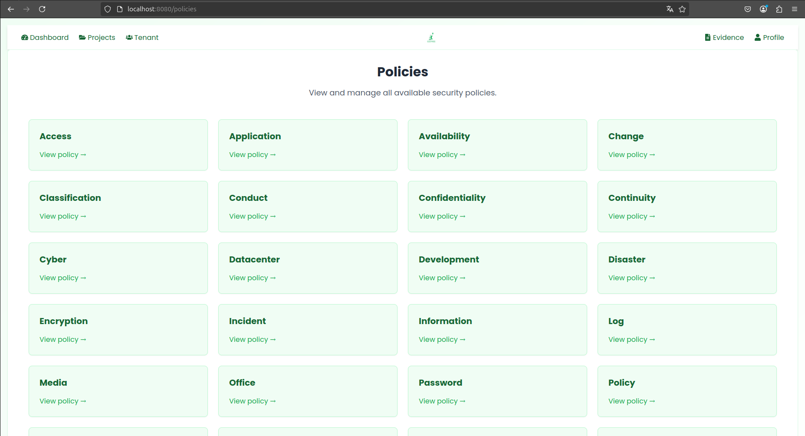
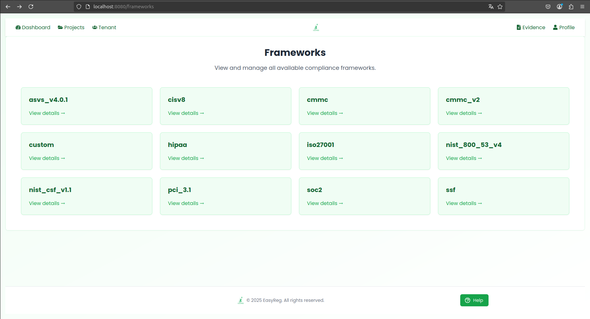

## 🔐 Autenticação – Login e Registo com Keycloak

A autenticação da aplicação EasyReg é realizada através da integração com o Keycloak, uma plataforma open-source para gestão de identidade e acesso. Este sistema permite realizar login seguro com tokens JWT, garantindo que apenas utilizadores autenticados tenham acesso às funcionalidades da aplicação.

A interface inicial (ver Imagem 1) apresenta uma página simples e intuitiva desenvolvida em React.js, com um botão de login "Sign in with Keycloak". Ao clicar, o utilizador é redirecionado para a página de autenticação gerida pelo próprio Keycloak (Imagem 2), onde pode inserir as suas credenciais, recuperar a password ou registar-se como novo utilizador.

Este processo permite delegar toda a lógica de autenticação e gestão de utilizadores a um serviço especializado, mantendo o foco da aplicação na gestão de conformidade.

> 📷 Imagem 1 – Tela inicial

    Tela inicial com branding da aplicação e botão para iniciar sessão com Keycloak.

📷 Imagem 2 – Interface de login do Keycloak

    Página de autenticação padrão

## 🏠 Página de Entrada – Dashboard Inicial

Após o login, o utilizador é redirecionado para a página principal da aplicação, onde pode navegar pelas funcionalidades centrais da plataforma. A interface apresenta um painel limpo e organizado, com botões de acesso rápido para:

    📁 Visualizar e criar Tenants (entidades organizacionais);

    📚 Explorar as Frameworks de conformidade;

    📜 Aceder às Policies;

    📌 Gerir Evidências e Projetos (via menu de topo).

> 📷 Imagem 3 – Página principal após autenticação, com atalhos para Tenants, Frameworks, Policies e navegação superior.

## Gestão de Tenants

A página View Tenants apresenta uma listagem das entidades organizacionais (tenants) associadas ao utilizador autenticado. Esta interface permite gerir os tenants existentes e criar novos, sendo uma das principais entradas no fluxo de organização da plataforma.

Cada card apresenta:

    Nome do tenant;

    Data de criação;

    Email de contacto;

    Ações rápidas: ver detalhes, ver projetos associados, editar ou eliminar.

Ao clicar em "Add New Tenant", o utilizador pode criar uma nova entidade. O sistema associa automaticamente o owner_id do utilizador autenticado (obtido via token Keycloak) ao tenant recém-criado, garantindo que apenas o criador ou utilizadores com permissões apropriadas podem aceder à sua gestão.

> 📷 Imagem 4 – Página de listagem de Tenants, com possibilidade de criar, editar e navegar entre projetos associados.

## 📁 Gestão de Projetos

Através da opção "View Projects" no card de um tenant, o utilizador é redirecionado para a página de gestão de projetos associados àquela entidade. Esta funcionalidade permite visualizar todos os projetos criados dentro de um tenant específico, bem como criar novos projetos.

> 📷 Imagem 5 – Tabela com os projetos associados ao tenant, com opção de visualização e criação.

## 📝 Criação de Novo Projeto

Ao clicar em "Create Project", o utilizador é direcionado para um formulário de criação, onde pode:

    Inserir o nome e descrição do projeto

    Selecionar o tenant ao qual o projeto estará associado 

    Escolher a framework de conformidade a aplicar

    Associar utilizadores ao projeto, definindo os seus papéis

A criação de um projeto resulta também na criação de um subgrupo no Keycloak, garantindo isolamento e gestão de permissões por projeto.

> 📷 Imagem 6 – Formulário de criação de projeto, com associação a tenant e framework, e opção de adicionar utilizadores.

## 📜 Página de Policies

A página de Policies apresenta uma grelha com todas as políticas de segurança disponíveis na aplicação. 

Os dados são carregados a partir da base de dados MongoDB, onde os conteúdos das policies são armazenados em formato HTML estruturado.

Ao clicar em "View policy →", o utilizador é redirecionado para uma página de detalhe onde o conteúdo completo da política é exibido de forma formatada, facilitando a leitura e análise da informação.

> 📷 Imagem 7 – Lista de políticas de segurança disponíveis, organizadas por tema.

## 📚 Página de Frameworks

Na secção de Frameworks, os utilizadores têm acesso a uma coleção de normas de conformidade como OWASP ASVS, ISO27001, NIST, SOC2, entre outras.

Cada framework é apresentada como um card, e ao clicar em "View details →", é aberta uma página com:

    A lista dos controls associados;

    Dentro de cada control, os respetivos subcontrols, se existirem;

Estes dados são também carregados dinamicamente da base de dados MongoDB, mantendo o frontend sincronizado com a estrutura definida no backend.

> 📷 Imagem 8 – Grelha com frameworks de conformidade disponíveis no sistema EasyReg.