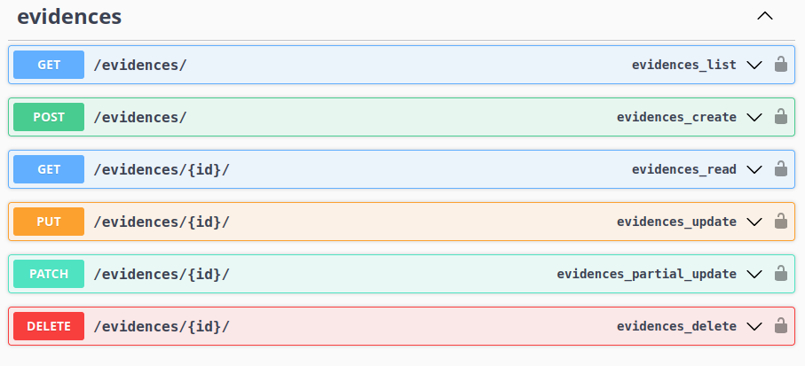
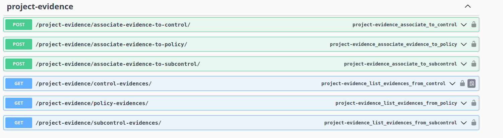
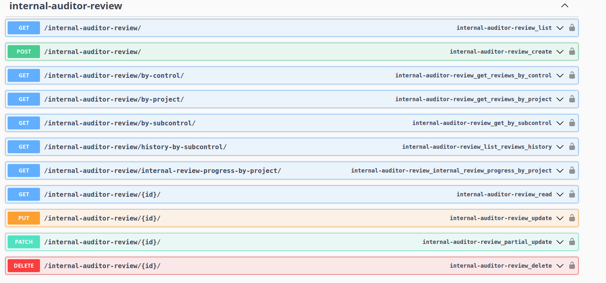
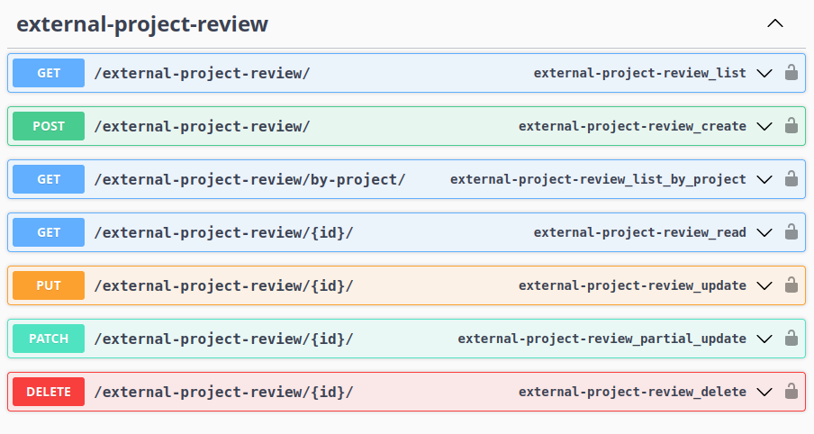
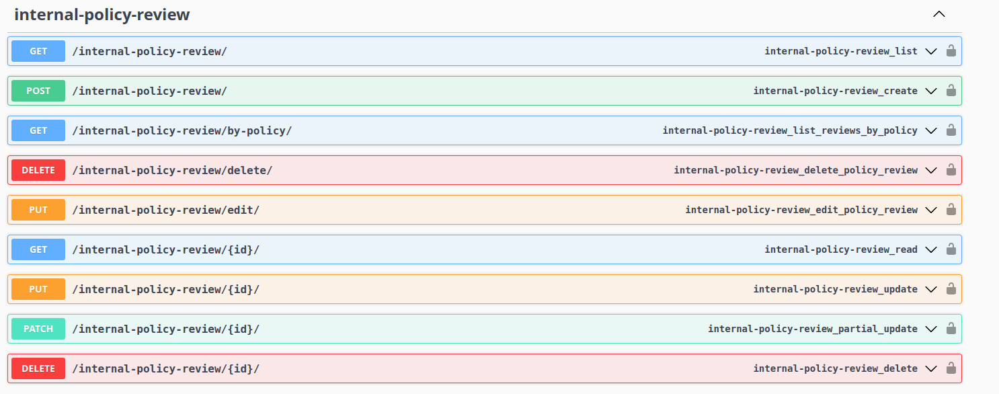
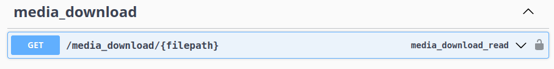

## 🔧 Backend – Entrega Final (MS4)

Durante a MS4, foram concluídos os seguintes pontos-chave:

    - Submissão, listagem, edição e eliminação de evidências, com possibilidade de associação a controlos, subcontrolos ou políticas;

    - Gestão de ficheiros de evidência, incluindo download autenticado através de endpoint dedicado;

    - Sistema completo de revisões internas por controlo, subcontrolo ou projeto, com histórico e monitorização do progresso da auditoria;

    - Implementação da revisão externa por projeto, permitindo a validação final das auditorias internas por parte de auditores externos;

## 📎 Gestão de Evidências

O módulo evidences permite criar, consultar, atualizar e remover evidências submetidas por membros de projeto. Estas evidências podem depois ser associadas a controlos, subcontrolos ou políticas.

A API permite:

    - Listar e criar evidências (GET /evidences/, POST /evidences/);

    - Visualizar, editar e eliminar evidências (GET, PUT, PATCH, DELETE por ID);

    - Todas as operações exigem autenticação com permissões de projeto.

>📸 Imagem – Endpoints de gestão CRUD de evidências submetidas pelos utilizadores.

## 📌 Associação de Evidências

O módulo project-evidence permite associar evidências criadas anteriormente a elementos específicos do projeto, como controlos, subcontrolos ou políticas.

A API permite:

    - Associar evidências a controlos, subcontrolos ou policies;

    - Listar evidências associadas a cada tipo de entidade;

    - Todas as operações são autenticadas e exigem pertença ao projeto.

>📸 Imagem – Endpoints para associar evidências aos componentes de conformidade do projeto.

## ✅ Revisão por Auditor Interno

O módulo internal-auditor-review permite aos auditores internos rever as evidências submetidas, registando observações e aprovações diretamente ligadas a controlos e subcontrolos.

A API permite:

    - Submeter revisões (POST /internal-auditor-review/);

    - Listar revisões por projeto, controlo ou subcontrolo;

    - Consultar progresso geral de auditoria interna;

    - Consultar histórico de revisões por subcontrolo.

> 📸 Imagem – Endpoints de revisão interna por controlo, projeto e subcontrolo.

## 🕵️ Revisão por Auditor Externo

O módulo external-project-review permite que um auditor externo avalie o estado de conformidade de um projeto após a auditoria interna. Esta revisão atua como uma validação adicional, reforçando o rigor do processo de avaliação.

A API permite:

    - Listar todas as auditorias externas realizadas;

    - Criar novas revisões externas para projetos;

    - Obter todas as revisões associadas a um projeto específico;

    - Consultar, atualizar ou eliminar revisões por ID;

    - Todas as operações são protegidas por autenticação.

> 📸 Imagem – Endpoints de revisão externa, incluindo criação, consulta e gestão de auditorias por projeto.

## 🔍 Gestão de Revisões Internas de Políticas

O módulo internal-policy-review disponibiliza uma API REST que permite aos auditores internos criar, consultar, editar e eliminar revisões associadas a políticas de conformidade dentro de um projeto. Esta funcionalidade centraliza a avaliação das evidências fornecidas e garante o registo histórico de revisões feitas por cada auditor.

A API permite:

    - Listar todas as revisões realizadas ou filtrar por política e projeto;

    - Submeter uma nova revisão para uma política específica, associando comentários e estado (approved ou rejected);

    - Editar uma revisão previamente submetida com base no review_id;

    - Eliminar revisões tanto por review_id diretamente como via endpoint dedicado;

    - Todos os endpoints estão protegidos por autenticação JWT com permissões baseadas no papel do utilizador.

>📸 Imagem – Endpoints disponíveis para gerir revisões internas de políticas, incluindo criação, consulta, edição e remoção.

## ⬇️ Download de Ficheiros de Evidência

O módulo media_download disponibiliza um endpoint que permite o download seguro dos ficheiros enviados como evidência durante a submissão ou revisão de conformidade. Este endpoint garante que apenas utilizadores autenticados com permissões adequadas podem aceder aos ficheiros.

A API permite:

    - Realizar o download de ficheiros de evidência com base no caminho do ficheiro (filepath);

    - O acesso ao ficheiro está protegido por autenticação JWT;

    - Este endpoint é utilizado em conjunto com a gestão de evidências e revisões.

📸 Imagem – Endpoint protegido para o download de ficheiros submetidos como evidência.
