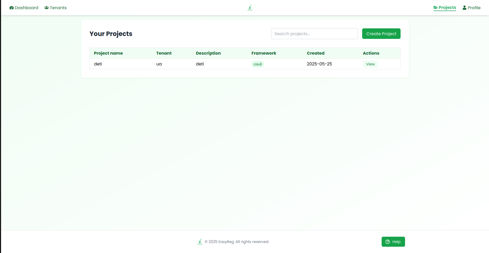
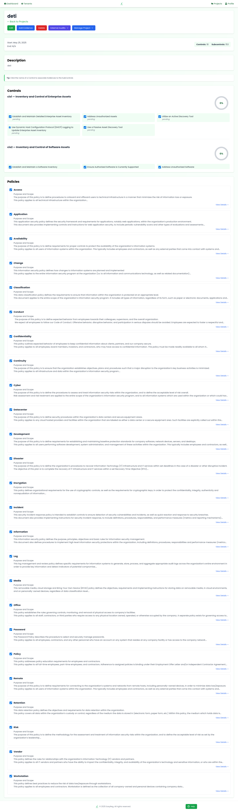
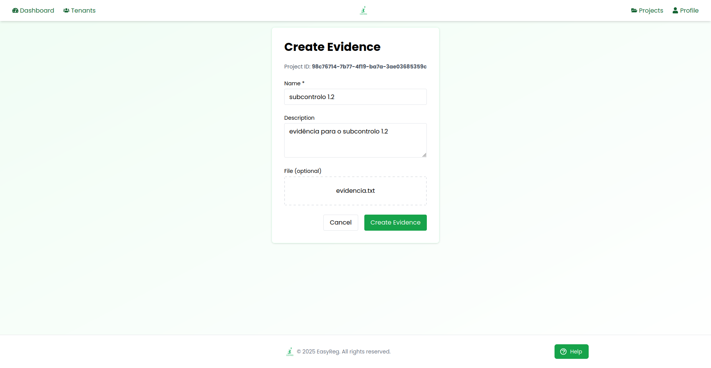
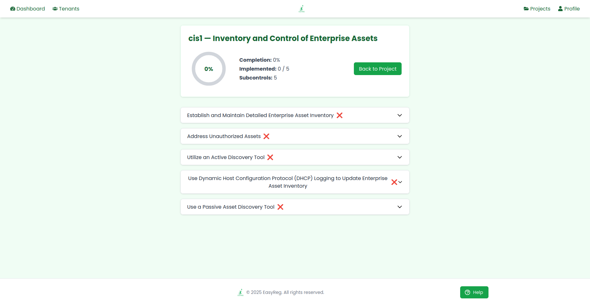
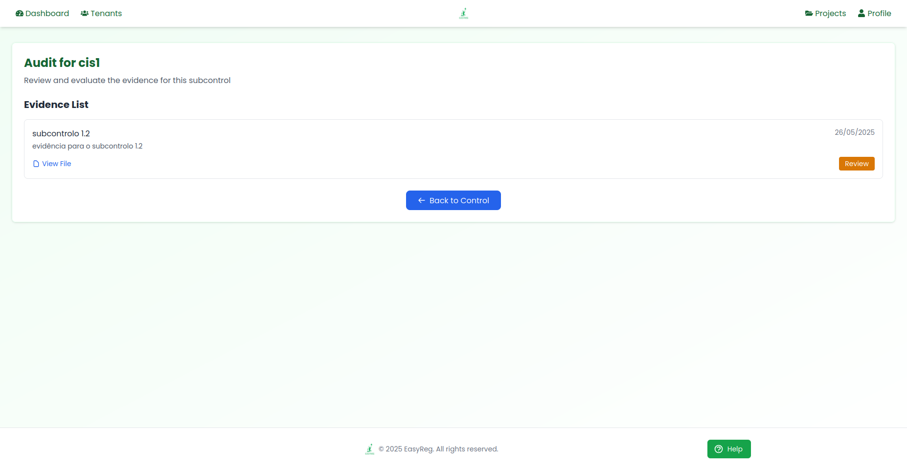
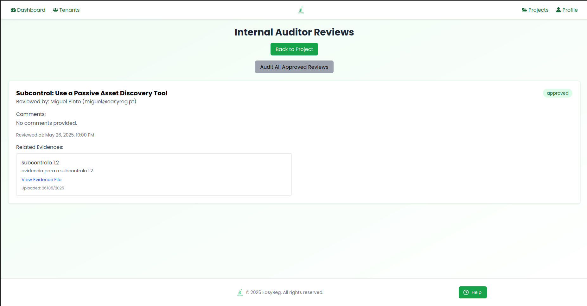

## 📁 Página de Projetos

Esta página apresenta a lista de projetos aos quais o utilizador foi associado. Cada projeto está ligado a um tenant (organização) e contém informações como a framework de conformidade usada e a data de criação.

As principais funcionalidades disponíveis nesta página são:

    - Listar os projetos do utilizador;

    - Pesquisar projetos pelo nome;

    - Criar um novo projeto;

    - Aceder aos detalhes de cada projeto (botão "View").

> 📸 Imagem X – Página que apresenta os projetos associados ao utilizador, com filtros e acesso ao detalhe de cada projeto.

## 📄 Página de Detalhe do Projeto

Esta página apresenta todas as informações detalhadas de um projeto específico criado dentro de um tenant. Aqui, os membros do projeto podem visualizar os controlos, subcontrolos e políticas associados, bem como submeter evidências e acompanhar o progresso da auditoria.

As principais funcionalidades disponíveis nesta página são:

    - Visualizar nome, descrição, data de criação e framework do projeto;

    - Aceder à lista de controlos e subcontrolos associados;

    - Submeter evidências para cada controlo ou subcontrolo;

    - Visualizar políticas associadas ao projeto;

    - Ver o progresso da auditoria interna por controlo;

    - Aceder aos botões de gestão: editar projeto, adicionar utilizadores e gerir permissões.

> 📸 Imagem X – Página de visualização completa de um projeto, com listas de controlos e políticas, gestão de evidências e progresso de auditoria.

## 📝 Página de Criação de Evidência

A criação de evidências permite aos membros de um projeto justificar o cumprimento de controlos ou subcontrolos através da submissão de documentação. Esta funcionalidade é essencial para o processo de auditoria interna e posterior validação externa.

As principais funcionalidades disponíveis nesta página são:

    - Inserir o nome da evidência;

    - Adicionar uma descrição explicativa;

    - Anexar um ficheiro opcional (ex: PDF, imagem, documento de texto);

    - Submeter a evidência associada a um controlo ou subcontrolo específico.

>📸 Imagem X – Página de criação de evidência, com campos de nome, descrição e upload de ficheiro.

## 📊 Página de Detalhe do Controlo

Esta página apresenta os detalhes de um controlo específico incluído no projeto, permitindo ao utilizador visualizar os seus subcontrolos, bem como o estado de implementação de cada um. A interface resume o progresso do controlo, permitindo avaliar rapidamente o grau de conformidade.

As principais funcionalidades disponíveis nesta página são:

    - Visualizar o nome e descrição do controlo selecionado;

    - Ver o número total de subcontrolos e quantos foram implementados;

    - Consultar o estado individual de cada subcontrolo;

    - Aceder às opções de submissão de evidência diretamente por subcontrolo.

> 📸 Imagem X – Página de visualização de um controlo e respetivos subcontrolos, com progresso e estado de implementação.

## 🔍 Página de Auditoria Interna

A auditoria interna permite que os utilizadores com o papel de auditor interno revejam e validem as evidências submetidas para cada controlo ou subcontrolo. Esta funcionalidade é essencial para garantir que a conformidade foi devidamente documentada antes da auditoria externa.

As principais funcionalidades disponíveis nesta página são:

    - Visualizar todas as evidências submetidas para um controlo ou subcontrolo específico;

    - Aceder ao ficheiro da evidência diretamente;

    - Ver a data de submissão e a descrição da evidência;

    - Iniciar o processo de revisão interna ao clicar em “Review”.

> 📸 Imagem X – Página de revisão interna, com lista de evidências associadas a um controlo ou subcontrolo, e opção para dar início à validação.

## 🕵️ Página de Revisão Externa Submetida

A revisão externa é a etapa final do processo de validação da conformidade no projeto. Nesta página, o auditor externo pode analisar o resultado da auditoria interna feita a um determinado subcontrolo e validar (ou não) essa decisão.

As principais funcionalidades disponíveis nesta página são:

    - Visualizar o subcontrolo revisto e o nome do auditor externo responsável pela avaliação;

    - Consultar os comentários deixados pelo auditor externo (caso existam);

    - Ver a data e hora da revisão;

    - Aceder à evidência aprovada previamente na auditoria interna;

    - Verificar o estado da revisão externa (ex: approved ou rejected);

    - Confirmar que a decisão do auditor externo é baseada na revisão interna e não diretamente na evidência.

>📸 Imagem X – Página onde o auditor externo valida ou contesta o resultado da auditoria interna realizada a um subcontrolo específico.